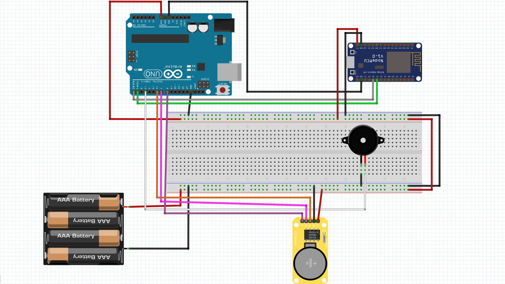

# IOTAlarmApp
This is an android app made in Unity to set alarm on an ESP8266. The app sends the alarms to a  [flask webserver](https://github.com/IdrisFallout/IOTAlarmApp-flaskapi) where the alarm are stored in a **Postgres** database. The server also filters these data for only enabled alarms and then forwards it to the ESP8266 via **MQTT**. The ESP8266 then forward the data over serial to the arduino which then plays the alarm sound on a buzzer. The arduino Uno is connected to a **RTC** to keep track of the time. Alternatively you could get the current time from an external server every second.

## Requirements
- ESP8266
- Arduino Uno
- RTC module
- Buzzer

## Installation
To set up the project you need do the following:
- Install the [app](App/IOTAlarmApp.apk) on your android device
- Ensure the [flask server](https://github.com/IdrisFallout/IOTAlarmApp-flaskapi) is running on your computer or the cloud
- Ensure the [arduino code](IOTAlarmApp/Assets/IOT/Arduino%20Code/Arduino%20Code.ino) is uploaded to the arduino
- Ensure the [ESP8266 code](IOTAlarmApp/Assets/IOT/ESP%20Code/ESP%20Code.ino) is uploaded to the ESP8266
- Ensure the circuit is wired up as shown in the diagram [here](#Wiring)

## Wiring

## Future Improvements
- Add a snooze functionality
- Add animations like loading on the app
